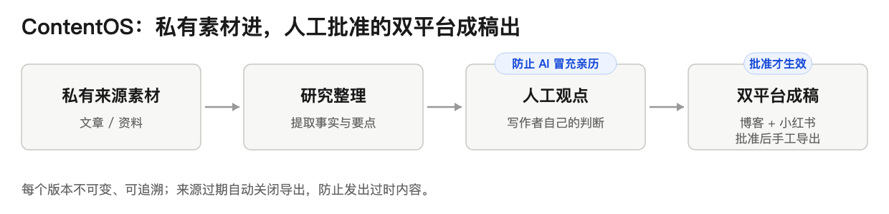
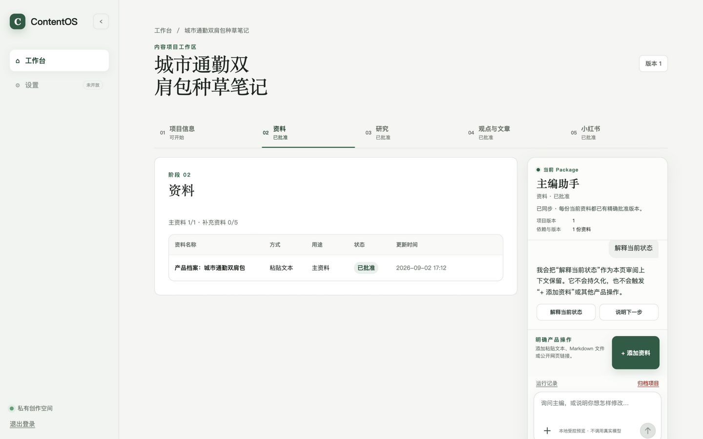
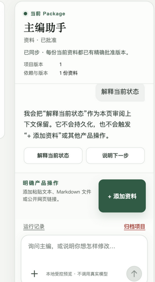
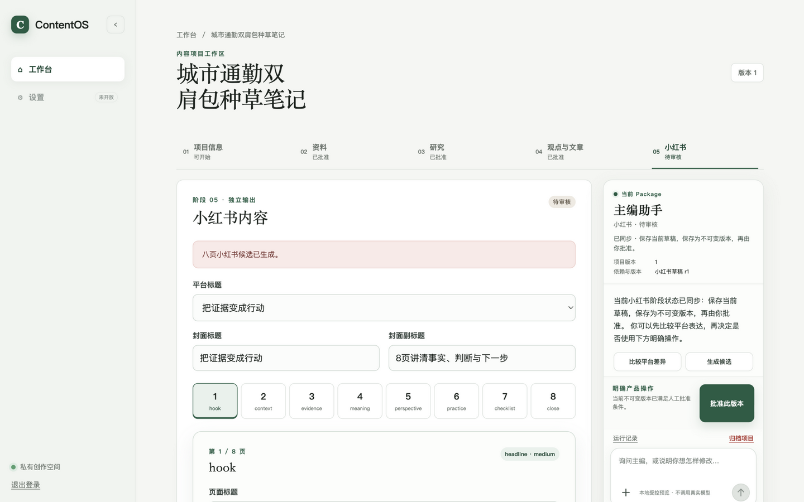

<div align="center">

# ContentOS

**Private source material in — human-approved, dual-platform content out.**


Language: [简体中文](README.zh-CN.md) | English

[Quick start](#quick-start) · [Issues](https://github.com/JettxonHo/ContentOS/issues) · [Decision Register](docs/decisions/decisions.md)

</div>

> The question this project answers: **how does a solo creator use AI without losing their own voice?** The answer is layering: facts belong to sources, opinions belong to you, AI only makes candidates — the three never blend.

## Contents

- [What it is](#what-it-is)
- [Features](#features)
- [Real running UI](#real-running-ui)
- [Verification status](#verification-status)
- [What makes it different](#what-makes-it-different-from-other-ai-writing-tools)
- [Quick start](#quick-start)
- [FAQ](#faq)

## What it is

A single-user, desktop-first personal AI content studio. You feed it private source material; it turns sources into research notes; you write your own opinion on top; and you get **human-approved** blog Markdown and Xiaohongshu text for manual export.

It is not a bulk-writing tool and not an auto-publishing system — its value is not generation speed but its review and traceability structure.



## Features

- **Source → Research → Opinion → Drafts**: a four-layer pipeline where every layer is an independently reviewable resource
- **Immutable versions & approval**: approved content versions are immutable; stale upstream sources automatically close export of older versions
- **No fabricated personal experience**: Research-based mode is forbidden from inventing first-person claims; opinions can only be written explicitly by you
- **Chief-editor assistant panel** (V0.3): conversational view of current stage and next action — read-only suggestions, it cannot save or approve for you
- **Xiaohongshu paged editor** (V0.2 Chinese workspace): a focused eight-page editing experience
- **Manual export**: portable `article.md` / `post.md` / `pages.json` text export; the publish action stays in your hands

## Real running UI

| Chinese creator workspace | Chief-editor assistant | Xiaohongshu page editor |
|---|---|---|
|  |  |  |

## Verification status

> As of 2026-09-02, consistent with the M5 acceptance record and Roadmap.

| Verification | Status |
|---|---|
| Text-first MVP | M0–M5 complete; formal acceptance record effective on main (required CI green) |
| UX iterations | V0.1–V0.3 shipped from bounded external observations: truthful guidance, Chinese workspace redesign, chief-editor panel; V0.3 alone passed 628 local + 188 integration + 20 browser tests |
| Honest boundary | Real Provider, production deployment and automatic publishing remain unimplemented; chat and suggestions cannot save, approve, export or call a model |

## What makes it different from other AI writing tools

- **Three-layer separation**: facts, opinions and AI candidates each have an owner; AI cannot impersonate your experiences
- **Stale sources lock export**: prevents publishing content built on outdated material
- **Immutable versions**: approvals and rejections both leave a record — nothing is silently overwritten

## Quick start

See "Current setup" below (pnpm workspace with infrastructure and migration steps).

## FAQ

**Does it publish automatically?**
No. Export is manual portable text; the publish action is always yours. Automatic publishing is explicitly out of scope.

**Does it support multi-user collaboration?**
No. It is deliberately single-user and desktop-first; multi-user and public registration are explicitly out of scope.

**Can the chief-editor assistant approve content for me?**
No. It only explains current state and suggests next actions; it cannot save, approve, export or call a model.

---

> The sections below remain the authoritative product and governance documentation (unchanged, starting at "## Current status").

## Current status

The repository has completed **M0–M5** and the formal private text-first MVP. [M5 Acceptance Record 001](docs/implementation/m5-acceptance-record-001.md) is effective through PR #296, first-attempt required CI, and squash `987eb7a051a97f1522069a9673e976e0cf06b901`; Issue #295 is Closed/Completed.

This repository now provides workspace installation, quality checks, builds, five process entry points, isolated local state services, authentication, Source/Workflow/Fetcher foundations, Research, Human Opinion, and independently approved Blog/Xiaohongshu text with eligible `article.md`, `post.md`, and `pages.json` downloads. The effective M5 record validates this complete private text-first path on current main. PostgreSQL and the API remain authoritative; Raw Provider output is server-side only. No real Provider, generic Agent runtime, Render, image/ZIP Export Package, automatic publishing, production deployment, or development server exists yet.

## Post-MVP UX iterations (V0.1–V0.3)

After M5 acceptance became effective, three bounded presentation-layer iterations shipped from bounded external observations (none change Domain/API/persistence truth or the Fake Provider boundary):

| Version | Content | Merge |
|---|---|---|
| V0.1 | Truthful workspace guidance derived from existing resources; explicit stale-Opinion recovery; versioned external manual Blog/Xiaohongshu prompt & eval artifacts | PR #301, CI 4/4 |
| V0.2 | Chinese-first creator workspace and IA redesign | PR #303, CI 4/4 |
| V0.3 | Figma-approved deterministic chief-editor conversation panel; 628 local + 188 integration + 20 browser tests green | PR #304, CI 4/4 |

Chat and suggestions cannot save, apply, approve, export or call a Provider; real Provider, production deployment and automatic publishing remain unimplemented.

## One sentence for visitors

This is a single-user content studio that constrains "AI-generated content" to be **source-traceable, version-immutable, and real only after human approval** — its value proposition is not generation speed, but the review and provenance structure.


  

Real local run (2026-09, deterministic Fake Provider): source intake → approval → research → opinion confirmation → article approval → eight-page Xiaohongshu approval; no real model is called.

## MVP boundary

The formal MVP is a private, single-user, desktop-first web application with human review. It independently produces approved Blog Markdown and approved Xiaohongshu text from a shared Content Foundation, then supports manual portable-text export and publishing. Design, image generation, PNG rendering, rich asset packages, production deployment, public registration, automatic publishing, multi-user collaboration, and unsupported media inputs are post-MVP or out of scope. Read the complete [MVP Scope](docs/product/mvp-scope.md) and approved execution [Goal](GOAL.md).

## Repository contents

The repository currently contains:

- historical [Sessions](docs/sessions/);
- the [Canonical Decision Register](docs/decisions/decisions.md);
- Product, Architecture, Security, and Quality Current-truth specifications;
- Implementation governance: [Roadmap](docs/implementation/roadmap.md), [Milestone Exit Criteria](docs/implementation/milestone-exit-criteria.md), and [Work Item template](docs/implementation/work-item-template.md).

The current workspace contains five applications and six packages. G1–G3 add no package or application: Research, Opinion, Blog, and Xiaohongshu rules live in `core`; strict HTTP contracts live in `contracts`; additive persistence lives in `database`; protected composition lives in `api`; and the private review flows live in `web`. Remaining planned packages stay absent until bounded post-MVP Work Items require them.

## Authoritative documentation map

- [Agent and repository rules](AGENTS.md)
- Product: [definition](docs/product/product-definition.md), [users and jobs](docs/product/user-and-jobs.md), [MVP scope](docs/product/mvp-scope.md)
- Architecture: [domain overview](docs/architecture/domain-overview.md), [Content Package foundation](docs/architecture/content-package-foundation.md), [Source foundation](docs/architecture/source-foundation.md), [technical architecture](docs/architecture/technical-architecture.md), [repository structure](docs/architecture/repository-structure.md), [workflow overview](docs/architecture/workflow-overview.md)
- Security: [security baseline](docs/security/security-baseline.md), [authentication foundation](docs/security/authentication-foundation.md)
- Quality: [test strategy](docs/quality/test-strategy.md), [release gates](docs/quality/release-gates.md), [Research Eval baseline](docs/quality/evals/research-core-v1.json), [local quality toolchain](docs/quality/local-quality-toolchain.md), [integration smoke harness](docs/quality/integration-smoke-harness.md), [browser acceptance](docs/quality/browser-thin-slice.md), [M2 acceptance harness](docs/quality/m2-acceptance-harness.md), [CI skeleton](docs/quality/ci-skeleton.md)
- Implementation: [roadmap](docs/implementation/roadmap.md), [exit criteria](docs/implementation/milestone-exit-criteria.md), [M1 Acceptance Record 001](docs/implementation/m1-acceptance-record-001.md), [M2 Acceptance Record 002](docs/implementation/m2-acceptance-record-002.md), [Work Item template](docs/implementation/work-item-template.md), and [agent collaboration workflow](docs/implementation/agent-collaboration-workflow.md)
- [Decision Register](docs/decisions/decisions.md)
- [Contribution guide](CONTRIBUTING.md)

## Development lifecycle

```text
Work Item → Plan → Implementation → Verification → Review → Commit
```

A Work Item must be Ready before implementation, and a commit is never implicit. Accepted DEC and Current-truth specifications take precedence over a Work Item when they conflict.

## GitHub workflow

The repository is privately hosted on GitHub. Create a bounded Work Item, Bug, or Decision Review with the matching [GitHub Issue Form](.github/ISSUE_TEMPLATE/); work on a branch associated with that Issue; then open a Pull Request using the [GitHub PR template](.github/pull_request_template.md). GitHub forms are an adaptation layer: the [Work Item contract](docs/implementation/work-item-template.md) and platform-neutral templates remain authoritative.

## Current setup

Use Node.js 24.18.0 (declared in `.node-version`) and Corepack-managed pnpm 11.17.0:

```bash
corepack pnpm install
corepack pnpm install --frozen-lockfile
corepack pnpm format
corepack pnpm format:check
corepack pnpm lint
corepack pnpm typecheck
corepack pnpm test
corepack pnpm test:integration
corepack pnpm test:integration:concurrent
corepack pnpm test:browser
corepack pnpm build
corepack pnpm check
corepack pnpm workspace:check
corepack pnpm check:docs
corepack pnpm check:decisions
corepack pnpm check:secrets
corepack pnpm repository:check
```

Before a commit, run `corepack pnpm check`. It runs `format:check`, `lint`, `typecheck`, `test`, and `build` without starting Docker services, reaching the network, or reading Secrets. The Docker-dependent `test:integration`, `test:integration:concurrent`, and `test:browser` commands are excluded from `check`. `corepack pnpm repository:check` (and the focused `check:docs`, `check:decisions`, and `check:secrets`) run dependency-free repository-integrity checks over Git-tracked files.

After a successful build, the processes can be started with `corepack pnpm start:web`, `start:api`, `start:worker`, `start:fetcher`, or `start:renderer`. Web provides login, Dashboard, Content Package and Source review, Research review, Human Opinion confirmation, explicit Creator-led/Research-based selection, independent Blog/Xiaohongshu editing, checkpoint, exact Approval, provenance review, and portable text downloads. API provides liveness, authentication, owner-scoped Content Package/Source/Workflow/Research/Opinion/Blog/Xiaohongshu routes, the private non-OpenAPI Fetcher Gateway, and `/openapi.json`. Deterministic local Fake Providers expose no Raw Provider output; Worker and Fetcher retain their scoped delivery identities. Web and API startup require the validated values documented in `.env.example`.

Generate a local owner-password hash interactively, then apply the committed database migration only after supplying the intended PostgreSQL URL through the environment:

```bash
corepack pnpm auth:hash-password
corepack pnpm db:migrate
```

The password-hash command does not accept plaintext through command-line arguments. The migration command never runs automatically during API startup.

To prepare local state services, copy `.env.example` to an untracked `.env`, replace every placeholder, then run:

```bash
corepack pnpm infra:config
corepack pnpm infra:pull
corepack pnpm infra:up
corepack pnpm infra:status
corepack pnpm infra:logs
corepack pnpm infra:down
```

The Compose baseline runs PostgreSQL on `127.0.0.1:5432`, Redis on `127.0.0.1:6379`, and SeaweedFS `weed mini` S3-compatible object storage on `127.0.0.1:8333` unless overridden in `.env`. Its other internal component ports are not exposed to the Host. The local image is fixed to SeaweedFS `4.29` and its verified manifest digest. `infra:down` retains named volumes. The API connects to PostgreSQL for server-side Sessions, Content Package metadata, Source metadata, and the API-owned Fetcher Task lease; it connects to S3-compatible Object Storage for immutable Raw Snapshot bytes after the migrations are applied. The Worker connects to PostgreSQL and Redis for delivery-only dispatch. The Fetcher connects only to its independent Redis and Object Storage identities, its configured literal-loopback Gateway origin, and controlled public HTTP/HTTPS; it never receives `DATABASE_URL`. There is no Agent, Render, or production deployment.

To verify the five application skeletons and the local state services work together through their real entry points and containers, run:

```bash
corepack pnpm test:integration
```

This starts an isolated `contentos-smoke-*` Compose project that replaces persistent volumes with `tmpfs`, binds ephemeral ports to `127.0.0.1` only, uses a run-unique temporary directory and credentials outside the repository, applies the reviewed migrations, and exercises the private API/PostgreSQL path through Sources, Research, Opinion, Blog, Xiaohongshu, exact Approval, Outdated propagation, owner/archive denial, and portable exports. It never reads, mounts, or changes the `contentos-local` named volumes.

Run `corepack pnpm test:integration:concurrent` to launch two complete token-owned smoke runs concurrently and verify that their directories, state, Compose projects, ports, credentials, and cleanup remain isolated from each other and from unrelated harness runs.

After installing the pinned Chromium revision with `corepack pnpm exec playwright install chromium`, run `corepack pnpm test:browser` to exercise the current owner-browser suite through both approved text branches and the three downloads. Read [Browser Acceptance](docs/quality/browser-thin-slice.md) and [M2 Acceptance Harness](docs/quality/m2-acceptance-harness.md) for its security, cleanup, and scope boundaries.

These commands cover the private text-first MVP plus the retained M2 delivery/recovery boundary. There is no `dev`, real Provider execution, generic Agent runtime, Design/Render/image package, automatic publishing, production deployment, or broad post-MVP operations suite.

## Continuous integration

A bounded GitHub Actions workflow at [.github/workflows/ci.yml](.github/workflows/ci.yml) runs on pull requests, pushes to `main`, and manual dispatch. It uses the GitHub-hosted `ubuntu-24.04` runner with read-only permissions, pins the only two reusable actions to immutable commit SHAs, resolves Node from `.node-version`, activates Corepack pnpm `11.17.0`, and installs with the frozen lockfile. It runs three required jobs:

- a Docker-independent job: workspace resolution, `corepack pnpm check`, and `corepack pnpm repository:check` (Markdown local-link, Canonical Decision register, and Secret checks);
- a Docker-dependent job: `corepack pnpm test:integration` through the existing isolated smoke harness.
- a current text-first browser job: pinned Playwright Chromium runs `corepack pnpm test:browser` against an isolated runtime.

The workflow references no repository Secrets, persists no credentials, uploads no artifacts, and performs no deployment or release. It is a bounded baseline, not a full release gate. All three jobs must pass before a change can merge. Read [CI Skeleton](docs/quality/ci-skeleton.md) for the full scope.

## Next implementation steps

1. Keep real Provider calls, production deployment, Design/Render, rich packages, backup/restore, and automatic publishing behind separately approved post-MVP Goals and Work Items.
2. Do not start M6 or another post-MVP Goal without explicit human approval.

No completion date is committed by this repository.

## Contributing

Read [CONTRIBUTING.md](CONTRIBUTING.md), the [Work Item template](docs/implementation/work-item-template.md), and [AGENTS.md](AGENTS.md) before starting a change.

## Historical documents

[Sessions](docs/sessions/) preserve discussion history, and [vision.md](docs/product/vision.md) preserves product background. Implementation should begin with Current-truth specifications and the Decision Register. Historical documents do not automatically override later Accepted DEC.
