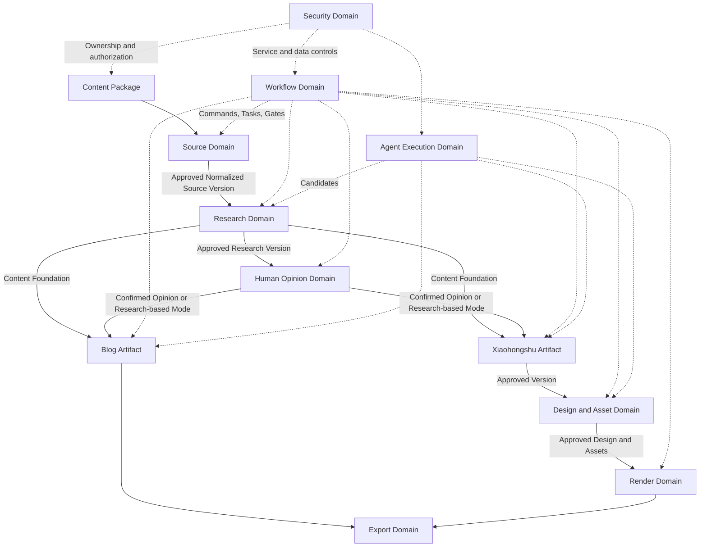

# ContentOS Domain Overview

**Status:** Current Truth

**Scope:** Domain concepts, responsibilities, relationships, and invariants

**Last Updated:** 2026-08-12

This document defines the current ContentOS domain language. It describes conceptual ownership and lifecycle boundaries, not code types, Schemas, persistence layouts, APIs, deployable processes, or framework modules.

---

## 1. Domain Purpose

The ContentOS domain model supports a content-production workflow that is:

```text
Traceable
Reviewable
Versioned
Recoverable
Exportable
```

The model must preserve what was captured, what AI inferred, what the user confirmed, which exact Versions were used, what was approved, and what can legally become a formal Export. Text generation is only one activity inside that lifecycle.

## 2. Domain Map



Solid arrows show content and Version dependencies. Dotted arrows show coordination or control. They do not imply that all domains share one transaction or deployable process.

## 3. Content Package

The **Content Package** is the business aggregate root and core aggregate entry for one content-production project. It owns the stable Package identity and coordinates:

- Content Mode and requested output branches;
- Package lifecycle and archive state;
- Current workflow context;
- References to current Artifact families and relevant Heads;
- The relationship among Sources, Research, Human Opinion, outputs, Design, Render, and Export.

The Content Package is not a giant JSON document containing every Body, page, file, run, event, and Version. Those objects retain their own identity, lifecycle, owner module, validation, and persistence boundary.

Blog and Xiaohongshu belong to the same Content Package, but they are separate Artifacts with separate Bodies, Working Copies, Versions, Heads, validations, and Approvals.

## 4. Artifact

An **Artifact** is a content asset with a stable business identity across editing and generation cycles.

- An Artifact is distinct from any one Artifact Version.
- An Artifact is not equivalent to its latest Body or one generated response.
- A Mutable Working Copy represents in-progress editing.
- Immutable Versions represent durable checkpoints.
- Artifact Head identifies the Versions and Working Copy relevant to current operations.
- Each Artifact type retains a type-specific Body Contract and domain rules.

Research Result, Human Opinion, Blog, Xiaohongshu, and Design Specification follow the shared Artifact lifecycle. Normalized Source content and Assets also use explicit version identity where their domain rules require it.

ContentOS does not use one universal Artifact JSON model to erase the differences among Research Items, Blog Markdown, Xiaohongshu pages, Design bindings, or Asset metadata. Shared metadata conventions do not replace type-specific Contracts.

## 5. Source Domain

The Source Domain owns capture and the formal material supplied to Research.

| Concept                   | Domain meaning                                                                                          |
| ------------------------- | ------------------------------------------------------------------------------------------------------- |
| Source Reference          | Stable identity and submission context for where material came from.                                    |
| Raw Snapshot              | Immutable evidence of what ContentOS captured at a specific time. A recapture creates another Snapshot. |
| Extracted Content         | Machine-produced readable content derived from one Raw Snapshot. It is not original evidence.           |
| Normalized Source Version | Reviewed, immutable Source content approved as a formal Research input.                                 |
| Primary Source            | The single Source that defines the Package's main content center.                                       |
| Supporting Source         | One of zero to five Sources providing context, verification, disagreement, or supplementary evidence.   |

The formal chain is:

```text
Source Reference
→ Raw Snapshot
→ Extracted Content
→ Normalized Source Working Copy
→ Immutable Normalized Source Version
→ Approval for Research
```

Raw Snapshots cannot be edited or overwritten. User corrections occur in normalization, not in the captured evidence. Research reads exact Approved Normalized Source Versions; it does not consume a URL, raw HTML, an unreviewed extraction, or a dynamically changing “current Source.”

Source Capture and Research are separate responsibilities. Capture obtains and normalizes material; Research interprets approved material.

## 6. Research Domain

The Research Domain turns approved Source Versions into a structured, reviewable content foundation. Research is not final publishing content.

| Concept             | Domain meaning                                                                                       |
| ------------------- | ---------------------------------------------------------------------------------------------------- |
| Research Result     | Stable Artifact representing one Package's structured analysis family.                               |
| Research Item       | Individually reviewable claim, fact, tension, term, opportunity, question, or other structured unit. |
| Source Evidence     | Typed link from a Research Item to an exact Source Version and stable evidence locator.              |
| Needs Verification  | Review state indicating that an item remains uncertain and cannot be presented as a confirmed fact.  |
| Review Working Copy | Mutable review state in which the user accepts, corrects, excludes, or reclassifies Research Items.  |
| Research Version    | Immutable checkpoint containing reviewed structured Research and exact Source dependencies.          |
| Approval            | Append-only decision authorizing one exact Research Version for downstream use.                      |

AI-generated Research remains preserved. User correction creates a new Version through the Review Working Copy rather than changing the generated Version. Only Approved Research Items permitted by policy may enter Human Opinion, Blog, or Xiaohongshu work.

## 7. Human Opinion Domain

The Human Opinion Domain preserves the boundary between user evidence and AI assistance.

```text
Raw Response
→ AI Interpretation
→ Confirmed Opinion Statement
→ Optional Editorial Expression
→ Human Opinion Version
```

| Concept                     | Domain meaning                                                                                                          |
| --------------------------- | ----------------------------------------------------------------------------------------------------------------------- |
| Raw Response                | The user's original words; preserved independently from AI interpretation.                                              |
| AI Interpretation           | A structured proposal for how the system understood the response. It is not yet the user's view.                        |
| Confirmed Opinion Statement | A position, judgment, experience, or recommendation explicitly accepted by the user.                                    |
| Editorial Expression        | Optional AI-assisted wording that preserves a Confirmed Opinion and requires confirmation before representing the user. |
| Human Opinion Version       | Immutable set of confirmed opinion content and its exact Research dependency.                                           |

First-person claims must trace to an eligible Confirmed Opinion Statement and, for experience claims, to confirmed experience. AI Interpretation alone never grants that authority.

Research-based Mode is a legal workflow path when the user skips Human Opinion or has no meaningful personal contribution. It permits Research synthesis but forbids invented beliefs, experiences, team claims, or creator-specific judgment.

## 8. Publishing Domain

The Publishing Domain owns the two formal platform content families.

| Concept              | Domain meaning                                                                                                     |
| -------------------- | ------------------------------------------------------------------------------------------------------------------ |
| Blog Artifact        | Stable identity for the long-form Blog content family. Its MVP canonical Body is Markdown.                         |
| Xiaohongshu Artifact | Stable identity for the platform-native title, carousel pages, Caption, CTA, Hashtags, references, and provenance. |
| Blog Plan            | Generation metadata describing the intended Blog structure; it is not a second canonical Blog Body.                |
| Packaging Plan       | Generation metadata describing the Xiaohongshu narrative and content allocation; it is not publishable content.    |
| Working Copy         | Mutable editing state for one Artifact family.                                                                     |
| Approved Version     | Exact immutable Version authorized by an append-only Approval Record and selected by the Artifact Head.            |
| Export Package       | Portable, user-facing delivery package produced from eligible approved content and dependencies.                   |

Blog and Xiaohongshu consume the same Approved Content Foundation:

```text
Approved Research Version
+
Confirmed Human Opinion Version or Research-based Mode
```

They are planned, generated, edited, versioned, validated, and approved independently. Xiaohongshu does not depend on a shortened Blog by default, and neither Artifact becomes the other's canonical content source.

## 9. Visual and Asset Domain

The Visual and Asset Domain translates an Approved Xiaohongshu Version into reviewable visual intent and approved visual dependencies.

| Concept              | Domain meaning                                                                                     |
| -------------------- | -------------------------------------------------------------------------------------------------- |
| Design Specification | Authoritative structured contract between Visual planning and deterministic rendering.             |
| Component Registry   | Versioned set of allowed visual components and their capabilities.                                 |
| Brand Theme          | Versioned visual tokens and brand rules, separate from component structure.                        |
| Asset Request        | Structured request describing a needed visual Asset and its communication purpose.                 |
| Asset                | Stable identity for a visual resource across candidates and replacements.                          |
| Asset Version        | Immutable visual resource checkpoint with origin, review, attribution, and dependency information. |
| Design Working Copy  | Mutable visual configuration based on exact approved content and configuration Versions.           |
| Design Version       | Immutable Design Specification checkpoint with content bindings and exact dependencies.            |

Visual Agent may select registered components, define hierarchy, bind content, and request Assets. It must not alter Approved Xiaohongshu Canonical Content or maintain a second editable copy. A content-fit problem returns to Packaging review or becomes a Blocking Error.

Only an Approved Design Version and Approved Asset Versions may enter Final Render.

## 10. Render and Export Domain

| Concept        | Domain meaning                                                                                                              |
| -------------- | --------------------------------------------------------------------------------------------------------------------------- |
| Render Job     | One requested rendering execution with fixed input dependencies and eligibility rules.                                      |
| Render Output  | Immutable, versioned result of a successful render, including complete files, validation, hashes, and environment identity. |
| Preview Render | Review aid that may use a Design Working Copy and preview-eligible Asset candidates. It is not export-eligible.             |
| Final Render   | Atomic, validated output produced only from Approved Design and Asset Versions and other legal dependencies.                |
| Export Package | User-facing delivery bundle assembled from exact approved content and, for Xiaohongshu, the selected eligible Final Render. |

Render Output and Export Package are separate objects: the former records internal pixel production; the latter organizes the files and publishing preparation metadata delivered to the user.

Preview and Final Render have different eligibility rules. A Preview cannot become a formal Export merely because it looks complete. Re-rendering creates a new Render Output and never overwrites historical output.

`Exported` does not mean `Published`. Publication remains an external user action.

The text-first MVP exports Blog Markdown and Xiaohongshu text/carousel data without a Renderer. The post-MVP Renderer may produce Xiaohongshu carousel PNGs; public Blog rendering belongs to the publishing site rather than ContentOS.

## 11. Workflow Domain

| Concept             | Domain meaning                                                                       |
| ------------------- | ------------------------------------------------------------------------------------ |
| Workflow Template   | Versioned, fixed definition of allowed MVP stages, branches, Gates, and transitions. |
| Workflow Instance   | One Package-specific enactment of a Workflow Template.                               |
| Workflow Node State | Execution progress of one workflow step.                                             |
| Workflow Command    | Structured, authorized request for a state-changing action.                          |
| Workflow Event      | Append-only record of user-visible orchestration activity and history.               |
| Task                | Specific unit of work intended by the Workflow.                                      |
| Current Action      | Derived explanation of the next legal user or system action.                         |
| Human Gate          | Workflow Node that requires explicit user review or confirmation.                    |

Artifact State, Workflow Node State, and Workflow Instance State are different state categories:

- **Artifact State** describes the lifecycle and current eligibility of a domain content object.
- **Workflow Node State** describes execution progress for one step.
- **Workflow Instance State** describes the lifecycle of the overall workflow.

A user-facing current stage may be derived from these states but cannot replace them with one Package status field. State changes pass through structured Workflow Commands and deterministic policy; a Chat message is not itself an Approval or state transition.

## 12. Agent Execution Domain

| Concept               | Domain meaning                                                                                                                                            |
| --------------------- | --------------------------------------------------------------------------------------------------------------------------------------------------------- |
| Agent Spec            | Versioned authoritative behavior Contract: purpose, responsibilities, prohibited actions, input/output expectations, capabilities, and validation policy. |
| Prompt Template       | Independently versioned model-facing expression of an Agent Spec.                                                                                         |
| Model Configuration   | Independently versioned approved provider/model capability and execution configuration; it contains a Credential Reference, not a Secret.                 |
| Agent Run             | One logical execution under a fixed Agent Spec, Prompt Template, Runtime Policy, Model Configuration, and Frozen Input Snapshot.                          |
| Model Call Attempt    | One provider invocation inside an Agent Run. Fallback, repair, or regeneration creates another Attempt.                                                   |
| Frozen Input Snapshot | Immutable record of exact input and configuration Versions used when the Agent Run started.                                                               |
| Candidate             | Parsed output that may be evaluated for domain use but has no approval or execution authority.                                                            |
| Promotion             | Deterministic process that validates a Candidate and decides whether it may create a Version or become a Review Candidate.                                |

Task, Agent Run, and Model Call Attempt are distinct:

```text
Task: intended work
└── Agent Run: one logical execution
    ├── Model Call Attempt 1
    └── Model Call Attempt 2
```

Raw Model Output is untrusted diagnostic input. After parsing and validation it may become a Candidate. Neither Raw Model Output nor Candidate can directly approve content, execute a Workflow Command, modify current state, access Secrets, or publish. A successful Agent Run is not equivalent to Artifact Promotion or Approval.

## 13. Security Domain

The Security Domain defines ownership, identity, sensitive references, audit, and lifecycle controls at a conceptual level.

| Concept              | Domain meaning                                                                                                                                |
| -------------------- | --------------------------------------------------------------------------------------------------------------------------------------------- |
| Owner                | The single user who owns a root Content Package and its owned or derived data.                                                                |
| Principal            | Authenticated security identity evaluated for authorization, such as a user or Service Identity. A Principal is distinct from a domain Actor. |
| Service Identity     | Least-privilege Principal assigned to a background or isolated service boundary.                                                              |
| Credential Reference | Non-secret reference used to resolve a credential through the Secret boundary.                                                                |
| Security Audit Event | Append-only record of security-relevant access or configuration activity, distinct from a Workflow Event.                                     |
| Retention Policy     | Versioned rules governing how long different data classes and records are retained.                                                           |
| Delete Request       | Explicit lifecycle request that initiates authorization, impact analysis, confirmation, and policy-governed purge. It is not Archive.         |

Owner data must not be mixed across Packages or authorization boundaries. Agents and Services receive only the capabilities and data needed for the Task. The exact authentication, storage, encryption, purge, and audit mechanisms belong to Security specifications.

## 14. Aggregate and Ownership Boundaries

Content Package is the business aggregate entry, not a transaction that encloses the complete production system.

The following retain independent identity and lifecycle and are persisted independently as domain objects or records:

- Artifact and Working Copy;
- Artifact Version and Artifact Head;
- Approval, Dependency, and Provenance records;
- Task, Agent Run, and Model Call Attempt;
- Asset and Asset Version;
- Render Job and Render Output;
- Export Package;
- Workflow Instance, Command, and Event;
- Security Audit Event and Delete Request.

Each object is changed through the domain module that owns its rules. Package-level views may project current references across domains without taking ownership of their internal lifecycle.

Aggregate boundaries are not UI page boundaries. A Workspace page may read and coordinate several aggregates. Aggregate boundaries are also not deployable-process boundaries: several domains may live in one modular monolith, while an isolated process may execute a narrow responsibility without owning the domain model.

Framework modules do not define these domain boundaries. A framework composition module is not automatically a Domain Module.

## 15. Cross-domain Dependency Rules

1. Every important downstream Version binds exact upstream Versions through structured Dependency relationships.
2. Historical dependencies are immutable and are never rewritten to point at newer upstream content.
3. A new Approved upstream Version may make the current downstream Artifact stale, review-required, or outdated according to domain policy; it does not overwrite or delete historical Versions.
4. Adding, removing, or changing a dependency requires a new dependent Version rather than mutation of an existing Version.
5. Cross-module writes occur only through the owning module's Use Case or structured Command. Another module cannot patch owned state directly.
6. Query Projections and application queries may read across modules to build Dashboard, Workspace, Current Action, timeline, or review summaries.
7. A Projection is a read model, not an editable source of truth.
8. Provenance and Dependency are different: Dependency controls reproducibility and eligibility; Provenance explains evidence, authorship, or content usage.

## 16. Domain Invariants

- An Immutable Version cannot be edited, overwritten, or have its dependency set rewritten.
- Downstream formal work must reference exact Approved upstream Versions where policy requires Approval.
- Approval binds one exact immutable Version and must exist before that Version is treated as approved.
- A Blocking Error prevents Approval and formal Export; ordinary acknowledgement cannot bypass it.
- First-person positions and experiences must trace to eligible Confirmed Human Opinion.
- A Final Export can use only legal Approved dependencies and an eligible current output set.
- A Cancelled or superseded Task cannot promote a Late Result into current state.
- A stale-on-arrival Candidate cannot become the current Review Candidate.
- Historical Versions, Approval Records, dependencies, and Render Outputs are preserved until a separate retention or deletion process applies.
- Owner-scoped data cannot be read, combined, or written under another Owner.
- Renderer does not rewrite, delete, truncate, or reinterpret content.
- Raw Snapshot remains immutable.
- AI and Chat do not directly create Approval or authoritative state changes.

## 17. Terminology Glossary

| Term               | Canonical meaning                                                                                                   |
| ------------------ | ------------------------------------------------------------------------------------------------------------------- |
| Content Package    | Business aggregate root and product-level entry for one content-production project.                                 |
| Artifact           | Stable content-asset identity across Working Copies and Versions.                                                   |
| Working Copy       | Mutable, revision-controlled editing state; not formal history.                                                     |
| Artifact Version   | Immutable content checkpoint with exact dependencies and Schema Version.                                            |
| Artifact Head      | Explicit pointers to Working Copy, Latest Version, Review Candidate, and Approved Version.                          |
| Approval           | Append-only authorization of one exact immutable Version.                                                           |
| Content Foundation | Approved Research plus Confirmed Human Opinion, or explicit Research-based Mode.                                    |
| Dependency         | Exact upstream Version relationship used for reproducibility and eligibility.                                       |
| Provenance         | Typed trace from content or output to evidence, user contribution, Asset origin, or transformation.                 |
| Stale              | Upstream analysis or execution result that no longer reflects the current input context.                            |
| Outdated           | Downstream Artifact or output based on an older approved dependency; historical content remains valid.              |
| Invalidated        | Object known to have a defect, integrity failure, or security problem; not the normal result of an upstream update. |
| Candidate          | Validatable proposed output without approval or execution authority.                                                |
| Promotion          | Deterministic eligibility process for moving a Candidate toward formal Artifact state.                              |
| Human Gate         | Workflow step requiring an explicit user decision.                                                                  |
| Render Output      | Immutable internal pixel-generation result.                                                                         |
| Export Package     | Portable delivery bundle prepared for manual use or publication.                                                    |
| Owner              | User who owns the Package and its owned or derived data.                                                            |

## 18. Decision Traceability

| Domain area                                                           | Accepted Decisions                                | Primary historical sources                                                                                                                                                 |
| --------------------------------------------------------------------- | ------------------------------------------------- | -------------------------------------------------------------------------------------------------------------------------------------------------------------------------- |
| Content Package, Artifact, identity, ownership, and module boundaries | DEC-005–DEC-006, DEC-030–DEC-032, DEC-160–DEC-176 | [Session-002](../sessions/session-002.md), [Session-007](../sessions/session-007.md), [Session-019](../sessions/session-019.md)                                            |
| Source and Research                                                   | DEC-059–DEC-068, DEC-076–DEC-085                  | [Session-011](../sessions/session-011.md), [Session-012](../sessions/session-012.md), [Session-013](../sessions/session-013.md)                                            |
| Human Opinion                                                         | DEC-069–DEC-075                                   | [Session-012](../sessions/session-012.md)                                                                                                                                  |
| Blog and Xiaohongshu publishing content                               | DEC-043–DEC-058, DEC-076–DEC-097                  | [Session-009](../sessions/session-009.md), [Session-010](../sessions/session-010.md), [Session-013](../sessions/session-013.md), [Session-014](../sessions/session-014.md) |
| Visual, Asset, Render, and Export                                     | DEC-098–DEC-124                                   | [Session-015](../sessions/session-015.md), [Session-016](../sessions/session-016.md)                                                                                       |
| Workflow and Agent execution                                          | DEC-125–DEC-139, DEC-177–DEC-198                  | [Session-017](../sessions/session-017.md), [Session-019](../sessions/session-019.md)                                                                                       |
| Security concepts                                                     | DEC-199–DEC-220                                   | [Canonical Decision Register Index](../decisions/decisions.md)                                                                                                             |
| Final MVP boundaries                                                  | DEC-267–DEC-275, DEC-280–DEC-285, DEC-293–DEC-295 | [Session-024](../sessions/session-024.md), user confirmation 2026-08-12                                                                                                    |

The authoritative status and wording of all Decisions is maintained in the [Canonical Decision Register Index](../decisions/decisions.md).
