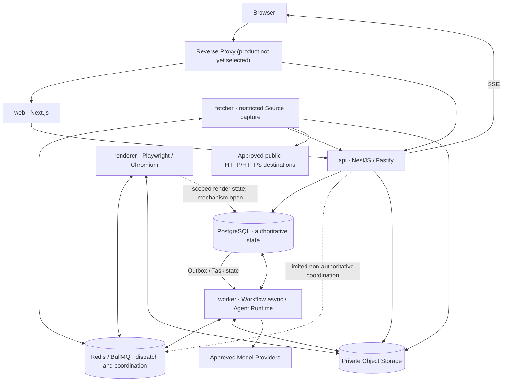

# ContentOS Process Topology

**Status:** Current Truth

**Scope:** MVP deployable processes, runtime responsibilities, permissions, communication, and recovery boundaries

**Last Updated:** 2026-08-07

This document defines the logical runtime topology for the ContentOS MVP. A process boundary provides workload and security isolation; it does not create a microservice, separate Domain model, separate database, or independent release.

Related documents:

- [Technical Architecture](technical-architecture.md)
- [Repository Structure](repository-structure.md)
- [Domain Overview](domain-overview.md)
- [Artifact Versioning](artifact-versioning.md)
- [MVP Scope](../product/mvp-scope.md)

---

## 1. Process Overview

The MVP has five deployable processes:

| Process    | Primary responsibility                                                  | Trust boundary                                                             |
| ---------- | ----------------------------------------------------------------------- | -------------------------------------------------------------------------- |
| `web`      | Product UI and structured editing experience                            | Browser-facing; no authoritative storage access                            |
| `api`      | Authenticated Queries, authoritative writes, Workflow Commands, and SSE | Primary application boundary                                               |
| `worker`   | Workflow asynchronous work and Agent Runtime                            | Model-capable but no arbitrary public Source fetch or Browser Final Render |
| `fetcher`  | Controlled public URL retrieval and Source safety processing            | Public-egress boundary with restricted credentials                         |
| `renderer` | Deterministic Preview and Final Browser rendering                       | Chromium boundary with public egress disabled                              |

The processes share one Repository, one authoritative Domain model, one primary PostgreSQL database, and one coordinated release context.

### Current implementation boundary

M0-ENG-002 created independently buildable and startable entry points. The current M2 boundary includes the API-owned URL-capture Command and Fetcher Gateway, Worker Outbox delivery and lease recovery, Fetcher orchestration, authoritative Workflow projection/Timeline REST reads, and active Workspace Source review. The Web uses explicit API Source edit/Version/Approval commands and one existing notification/Polling recovery controller to schedule authoritative Source and Timeline reads; it creates no Workflow store or write command. The Fetcher consumes only the fixed Queue contract, obtains its authority through the private Gateway, uses controlled public HTTP/HTTPS and its scoped Object Storage identity, and submits an exact Result. It does not access PostgreSQL.

## 2. Runtime Topology Diagram

The diagram is a logical topology. The reverse proxy product and Renderer state-access mechanism remain open. Fetcher Task and Source state are mediated by its private API Gateway; it has no PostgreSQL identity.

## 3. Web Process

The `web` process owns:

- Dashboard;
- New Package flow;
- Content Package Workspace;
- structured Editors;
- Chief Editor Panel presentation;
- Version review and comparison;
- Validation and next-action display;
- SSE client and Polling recovery.

The `web` process must not:

- Access PostgreSQL directly;
- Bypass the API to perform Approval, Version creation, or Workflow Commands;
- persist Provider, database, Object Storage, or other server Secrets;
- become the authority for Workflow or Task state;
- infer authoritative state from Chat history or local UI state.

Local editor state is provisional until accepted by an API mutation with the expected revision.

## 4. API Process

The `api` process owns:

- Authentication and secure session handling;
- server-side Authorization and ownership checks;
- Application Queries and Query Projections;
- Working Copy mutation;
- immutable Version creation;
- structured Workflow Commands;
- upload and download Authorization;
- API DTO validation and mapping;
- SSE endpoints;
- authoritative read APIs used by Polling recovery.

The API is the authoritative external entry point for Domain writes. It invokes owning-module Application Use Cases; it does not grant Controllers unrestricted table-write authority.

The API also owns the private Fetcher Gateway at
`/internal/fetcher/tasks/:taskId/{claim,heartbeat,result}`. These service routes use
the dedicated gateway Secret and opaque claim headers, are excluded from
OpenAPI, and do not expose a session or Cookie fallback. Claim and Heartbeat
update only the bounded PostgreSQL Task lease. The Result route records one
terminal, claim-bound `fetcher-result/v1` Result and, on a verified success,
attaches the URL Source evidence; it performs no Fetcher network or storage
write work.

The API must not execute long-running Agent calls, public URL fetches, or Browser Final Renders inline. It creates durable Tasks and Outbox records for asynchronous work.

## 5. Worker Process

The `worker` process owns general asynchronous application work, including:

- deterministic Workflow asynchronous execution;
- Agent Runtime and Agent execution;
- Chief Editor Planner execution under Workflow Policy;
- output parsing, Schema Validation, Domain Validation, and bounded repair;
- Candidate creation and controlled handoff to Promotion;
- Outbox Dispatch or Maintenance when those roles have not been split into separate processes;
- Task lease, heartbeat, idempotency, cancellation, and recovery checks.

The M2-WF-003C lease/delivery reconciliation slice is completed (PR #77, `ed428b1c12eb6e2ce01d964d56c05a09a3ba87d1`). It runs
inside the existing Worker pass, inspects at most ten expired eligible
Fetcher leases, and atomically requeues one Task, advances its existing Outbox
delivery generation, and records one redacted recovery Event before normal
current-generation dispatch. It does not consume Fetcher Jobs or perform URL,
result, Source, Object Storage, or public-network work.

The Worker may call approved Model Providers with minimum required data through Model Adapters. It must not:

- Fetch arbitrary public Sources;
- execute Final Browser Render;
- approve an Artifact or Warning on the user's behalf;
- publish content automatically;
- grant itself Tools or Secrets;
- modify canonical content except through the owning Application Use Case and Promotion policy.

## 6. Fetcher Process

The `fetcher` process owns the controlled Source-capture boundary:

- Public URL normalization and fetch;
- SSRF validation;
- DNS and redirect validation;
- protocol, port, size, duration, and response limits;
- immutable Raw Snapshot creation;
- extraction and safe representation processing;
- production of a Safe Source Candidate;
- quarantine processing where assigned by later implementation design.

The Fetcher has an independent Service Identity and controlled public HTTP/HTTPS egress. It receives restricted Object Storage permissions for quarantine and Source snapshots.

The Fetcher has no Model Provider Credential, no general Domain write permission, no Approval authority, and no access to Human Opinion. In `M2-FETCH-001C` review it receives only the fixed BullMQ delivery, Gateway Secret/origin, Fetcher-specific Redis and Object Storage identities, and controlled public HTTP/HTTPS egress. Claim, Heartbeat, Result, Task state, and Source promotion remain API-owned; it has no database credential.

JavaScript-heavy Browser Capture is not part of the baseline MVP. It may be proposed only if the supported Source Vertical Slice demonstrates a concrete need.

## 7. Renderer Process

The `renderer` process owns deterministic pixel generation:

- Preview Render;
- Final Render;
- Playwright and Chromium lifecycle;
- approved component, theme, font, Asset, Design, and Render Profile resolution;
- actual layout and file Validation;
- Render Environment Fingerprint;
- Render Output upload and reference return.

The Renderer has an independent Service Identity, a fixed Linux environment, and no public-network access. It has no Model Provider Credential, cannot read Raw Human Opinion, cannot modify canonical content, cannot change dependencies, and cannot create Approval.

Its Object Storage access is limited to approved render inputs and render-output locations. Its PostgreSQL access, whether direct through a scoped Adapter or mediated through another application boundary, remains an implementation decision.

A local developer Preview is useful feedback but does not automatically qualify as a Final Render. Final Render requires the pinned, controlled environment and Final validation policy.

## 8. Shared State Services

### PostgreSQL

PostgreSQL is the authoritative store for Domain, Workflow, Task, Approval, Version, dependency, Provenance, Outbox, Agent Run, Render, Export, lease, heartbeat, and execution metadata.

### Redis / BullMQ

Redis and BullMQ provide Queue delivery, delayed work, retry timing, Worker coordination, short-lived locks, and bounded fan-out. They do not contain the sole Workflow, Task, Artifact, Approval, or Version truth.

### Object Storage

Private S3-compatible Object Storage contains files, large objects, quarantine content, immutable snapshots, Assets, Render Outputs, and Export Packages. PostgreSQL retains durable references and lifecycle metadata.

For local development only, the M0 Compose baseline uses one SeaweedFS `weed mini` container with an authenticated S3 endpoint. Its internal master, volume, filer, and administration capabilities remain inside that one container and are not separate ContentOS services or a production topology. No ContentOS process connects to it in M0-INFRA-001.

## 9. Process Identity and Least Privilege

| Process    | Allowed services                                                                                       | Minimum data scope                                                         | Credentials it must not have                                                                        | Network boundary                                                      |
| ---------- | ------------------------------------------------------------------------------------------------------ | -------------------------------------------------------------------------- | --------------------------------------------------------------------------------------------------- | --------------------------------------------------------------------- |
| `web`      | API through product origin                                                                             | User-visible DTOs and provisional editor state                             | Database, Redis, Object Store administrative, Provider, server Secret                               | Browser/client network only                                           |
| `api`      | PostgreSQL, authorized Object Storage operations, limited Redis if required                            | Owner-scoped Domain data, Commands, Queries, transfer authorization        | Arbitrary public-fetch or Model Provider credentials unless a later explicit boundary requires them | Ingress through proxy; no arbitrary Source fetch                      |
| `worker`   | PostgreSQL, Redis/BullMQ, Object Storage, approved Model Providers                                     | Assigned Task, frozen inputs, Agent config, Candidates, execution records  | Fetcher identity, Renderer identity, broad storage administration                                   | Provider egress only as configured; no arbitrary public Source access |
| `fetcher`  | BullMQ channel, restricted Object Storage, approved public HTTP/HTTPS destinations, minimum state path | Fetch Task, URL policy, Source/quarantine objects, safe Candidate metadata | Model Provider, Human Opinion, Approval, general database, Render credentials                       | Controlled public egress; private/reserved destinations denied        |
| `renderer` | BullMQ channel, scoped render state path, approved Object Storage objects                              | exact approved render dependencies and output metadata                     | Model Provider, Raw Human Opinion, general database, public-fetch credentials                       | Public egress disabled; controlled internal services only             |

The table states architectural limits, not concrete IAM rules. Exact service accounts, roles, firewall rules, and policy syntax are deferred.

## 10. Communication Paths

| Path                               | Purpose and constraint                                                                                                  |
| ---------------------------------- | ----------------------------------------------------------------------------------------------------------------------- |
| Browser → Web                      | Page requests and client application assets through the product origin                                                  |
| Browser / Web → API                | Authenticated Queries, Commands, edits, Version operations, and transfer authorization                                  |
| API → PostgreSQL                   | Authoritative Application Use Cases, Transactions, Query Projections, Task and Outbox creation                          |
| API → Redis                        | Only optional bounded coordination; never the authoritative Task-dispatch path or state authority                       |
| Fetcher → API Gateway              | Private Claim/Heartbeat calls using the dedicated service Secret and opaque per-lease claim; no Cookie/session fallback |
| Dispatcher → Redis / BullMQ        | Deliver an already-created PostgreSQL Task from the Transactional Outbox                                                |
| Worker → PostgreSQL                | Load authoritative Task/frozen input and persist execution, Candidate, and controlled Domain results                    |
| Worker → Redis / BullMQ            | Consume Jobs and coordinate bounded retries                                                                             |
| Worker → Object Storage            | Read authorized inputs and write classified large outputs                                                               |
| Worker → Model Provider            | Send minimum Task-required context through an approved Model Adapter                                                    |
| Fetcher → Public Internet          | Controlled HTTP/HTTPS Source retrieval after SSRF, DNS, and redirect checks                                             |
| Fetcher → Restricted Storage       | Write quarantine, Raw Snapshot, extracted, or Candidate objects under scoped permissions                                |
| Renderer → PostgreSQL / state path | Read exact render-job references and persist render-owned metadata through the chosen scoped mechanism                  |
| Renderer → Object Storage          | Read exact approved dependencies and upload Render Outputs                                                              |
| API → SSE Client                   | Non-authoritative progress notifications; client recovers through full Queries and Polling                              |

## 11. Failure and Recovery Boundaries

| Failure                | Durable truth and recovery                                                                                                                                                                |
| ---------------------- | ----------------------------------------------------------------------------------------------------------------------------------------------------------------------------------------- |
| API restart            | In-flight HTTP requests may fail; committed PostgreSQL state remains. Clients retry idempotent Commands or reload Queries.                                                                |
| Worker crash           | Lease and heartbeat expire; BullMQ may retain an old Job; bounded Reconciliation verifies PostgreSQL state, records safe lease recovery, and dispatches only the next current generation. |
| Redis loss             | PostgreSQL Tasks and Runs remain; Reconciliation recreates missing Queue Jobs.                                                                                                            |
| Fetch failure          | Fetch Task records classified failure and bounded retry eligibility; incomplete content cannot become an approved Source.                                                                 |
| Renderer crash         | Temporary files are not Final output; persisted Render Job state and exact dependencies permit safe retry without mutating prior outputs.                                                 |
| Object Storage failure | Metadata records the failure; no database reference is promoted as usable until object write and integrity checks succeed.                                                                |
| SSE disconnect         | Client reconnects and uses Polling/full Query to recover; missed events do not change Workflow truth.                                                                                     |

In every case, PostgreSQL-backed state determines the final status. Queue, process memory, SSE delivery, and local files are evidence or transport, not authority.

## 12. Scaling Boundaries

All five processes may initially run as separate containers on one Host. Separation remains meaningful because identities, credentials, networks, filesystem permissions, and resource limits differ even on one machine.

Worker, Fetcher, and Renderer may later scale independently according to Queue category, concurrency, provider limits, public-fetch load, or Chromium capacity. Independent scaling does not turn them into microservices; they still share one Domain model, database authority, Repository, and release context.

## 13. Health and Shutdown

- **Liveness** indicates that a process event loop and essential runtime are alive; it must not perform expensive dependency work.
- **Readiness** indicates that the process can safely accept its assigned work under its required dependency policy.
- **Worker heartbeat** records bounded progress in PostgreSQL for crash detection and reconciliation.
- **Graceful shutdown** stops accepting new work, prevents new retry/repair starts, handles safe in-flight work, stops lease renewal, closes Browser/database/Redis resources, and flushes telemetry.
- **Lease expiration** permits recovery after a process stops renewing its ownership; it does not replace BullMQ's internal lock.

The current Fetcher Gateway uses a 60-second initial lease, a 20-second
heartbeat cadence, and a 120-second total lease cap. These values apply only
to the M2-WF-003B API-owned lease boundary. M2-WF-003C is completed (PR #77) for
Worker-owned expiry recovery and requeue; it does not change Fetcher
capabilities or add URL execution. Other process health dependencies and
shutdown timeouts remain implementation-specific.

## 14. Process Boundary Matrix

| Process    | Primary Responsibility                 | PostgreSQL Access                                   | Redis Access                          | Object Storage Access                              | Public Egress                 | Model Credential                      | Chromium           | Domain Write Authority                                         |
| ---------- | -------------------------------------- | --------------------------------------------------- | ------------------------------------- | -------------------------------------------------- | ----------------------------- | ------------------------------------- | ------------------ | -------------------------------------------------------------- |
| `web`      | UI and Editors                         | None                                                | None                                  | Only through authorized API/URLs                   | Product origin                | No                                    | No                 | None                                                           |
| `api`      | Auth, Queries, Commands, Versions, SSE | Read/write through owning Use Cases and projections | Optional limited coordination         | Authorize transfers and scoped metadata operations | No arbitrary Source egress    | No by default                         | No                 | Authoritative external entry point; ownership remains modular  |
| `worker`   | Async Workflow and Agent Runtime       | Scoped Task, execution, and Use Case access         | Queue consumer/dispatcher as assigned | Scoped Task inputs and outputs                     | Approved Model Providers only | Yes, by reference and least privilege | No                 | Only through owning Use Cases and Promotion policy             |
| `fetcher`  | Safe public Source capture             | Minimum scoped access; mechanism open               | Assigned Source Queue                 | Quarantine and Source snapshot scope               | Controlled public HTTP/HTTPS  | No                                    | No in baseline MVP | Source-owned Candidate/result path only; no general writes     |
| `renderer` | Deterministic Browser render           | Minimum scoped access; mechanism open               | Assigned Render Queue                 | Approved inputs and Render output scope            | No                            | No                                    | Yes, pinned        | Render-owned result metadata only; no canonical-content writes |

## 15. Open Implementation Decisions

The following process-topology details remain unresolved:

- Whether Outbox Dispatcher becomes a separate process;
- Whether Maintenance becomes a separate process;
- Whether API Readiness requires Redis;
- Fetcher database access mechanism;
- Renderer data retrieval mechanism;
- Container resource limits;
- Network Policy implementation.

No choice is made in this document.

## 16. Decision Traceability

| Process concern                                                          | Accepted Decisions                                | Primary historical sources                                                                                                      |
| ------------------------------------------------------------------------ | ------------------------------------------------- | ------------------------------------------------------------------------------------------------------------------------------- |
| Logical Agents, deterministic coordination, and no Agent microservices   | DEC-023–DEC-025, DEC-038–DEC-039, DEC-125–DEC-139 | [Session-006](../sessions/session-006.md), [Session-008](../sessions/session-008.md), [Session-017](../sessions/session-017.md) |
| Renderer execution and Final qualification                               | DEC-111–DEC-124                                   | [Session-016](../sessions/session-016.md)                                                                                       |
| Task, Outbox, idempotency, and execution records                         | DEC-160–DEC-198                                   | [Session-019](../sessions/session-019.md), [Session-020](../sessions/session-020.md)                                            |
| Process identity, SSRF, render isolation, Secrets, and telemetry privacy | DEC-199–DEC-220                                   | [Session-021](../sessions/session-021.md)                                                                                       |
| Five processes, queues, reconciliation, health, and deployment           | DEC-221–DEC-243                                   | [Session-022](../sessions/session-022.md)                                                                                       |
| M0 and MVP implementation boundary                                       | DEC-267–DEC-293                                   | [Session-024](../sessions/session-024.md)                                                                                       |

The authoritative status and wording of every Decision is maintained in the [Canonical Decision Register Index](../decisions/decisions.md).
